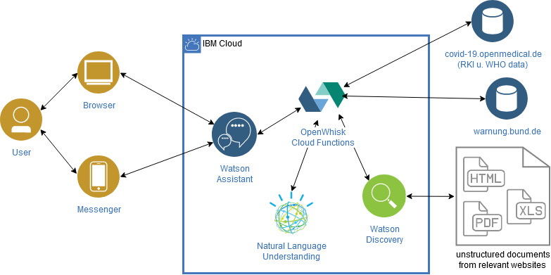

# Corina Chatbot Cloudfunctions - Corinas Wissenschatz

## Architektur



Wenn Watson Assistent einmal nicht weiterkommt oder aktuelle Daten aus dem Internet beziehen möchte, kommen die Cloudfunctions zum Einsatz. \
Die Cloudfunction führt verschiedene Tasks aus. 

## Dateien

Der Entry Point für dieses Projekt ist `__main__.py`, hier wird allerdings nur der Orchestrator geladen. Dieser ist in `orchestrator.py` und übernimmt das Routing der verschiedenen Tasks. `discovery.py` enthält Methoden zur Integration der Watson Discovery API. `risikogebiete.py` enthält ein Dictionary der aktuellen Riskogebiete (ACHTUNG: wird zur Zeit nicht automatisch aktualisiert!) und `translation_countries` ein Übersetzungsdictionary für Ländernamen. 


## Mögliche Tasks

### Natural Language Understanding API

TODO: Move API Keys to Secrets in CD

Anbindung einer Natural Language Understanding API: der User Input wird an die NLU gegeben und nach weiteren Intents oder Entities untersucht

Input:
- `action`: `NLU`
- `text`: \<zu prozessierender Text, string\>

Output:
```
{
    "entity": <Entity mit höchster Relevanz>
}
```

### Watson Discovery

TODO: Move API Keys to Secrets in CD

Anbindung von Watson Discovery: hier werden relevante Dokumente, Internetseiten und Tabellen nach weiteren Informationen durchsucht um auch Anfragen zu beantworten, die nicht im Watson Assistent hinterlegt sind. Anhand von User Feedback lernt der Algorithmus, die Relevanz der Informationen für die verschiedenen Anfragen besser einzuschätzen. \
Watson Discovery durchsucht die folgenden Resourcen mit Unterseiten (Stand 22.03.2020, die aktuelle Liste can auf cloud.ibm.net eingesehen werden):
- https://www.rki.de/DE/Content/InfAZ/N/Neuartiges_Coronavirus/nCoV.html
- https://www.rki.de/DE/Content/InfAZ/N/Neuartiges_Coronavirus/Steckbrief.html
- https://www.rki.de/DE/Content/InfAZ/N/Neuartiges_Coronavirus/Risikogebiete.html
- https://www.rki.de/DE/Content/InfAZ/N/Neuartiges_Coronavirus/Fallzahlen.html
- https://www.rki.de/SharedDocs/FAQ/NCOV2019/FAQ_Liste.html
- https://www.bbk.bund.de/DE/TopThema/TT_2020/TT_Covid-19.html
- https://www.bundesgesundheitsministerium.de/coronavirus.html
- https://www.rki.de/DE/Content/InfAZ/N/Neuartiges_Coronavirus/Risikogebiete.html
- https://www.rki.de/DE/Content/InfAZ/N/Neuartiges_Coronavirus/Fallzahlen.html
- https://www.rki.de/DE/Content/InfAZ/N/Neuartiges_Coronavirus/Transport/Info_Reisende_Tab.html
- https://www.bundesgesundheitsministerium.de/coronavirus.html
- https://www.bundesgesundheitsministerium.de/presse/pressemitteilungen/2020/1-quartal/krisenstab-bmg-bmi-sitzung-5.html
- https://www.bundesgesundheitsministerium.de/fileadmin/Dateien/3_Downloads/C/Coronavirus/Merkblatt-Bildungseinrichtungen-Coronavirus_DE.pdf
- https://www.bmi.bund.de/SharedDocs/faqs/DE/themen/bevoelkerungsschutz/coronavirus/coronavirus-faqs.html
- https://www.bmas.de/DE/Presse/Meldungen/2020/corona-virus-arbeitsrechtliche-auswirkungen.html
- https://www.rki.de/SharedDocs/FAQ/NCOV2019/FAQ_Liste.html
- https://www.bundesgesundheitsministerium.de/fileadmin/Dateien/3_Downloads/C/Coronavirus/BMGS_Coronavirus2_DE.pdf
- https://www.charite.de/klinikum/themen_klinikum/faq_liste_zum_coronavirus/
- https://www.zusammengegencorona.de/informieren/
- https://www.bundesgesundheitsministerium.de/coronavirus.html
- https://www.infektionsschutz.de/coronavirus/faqs-coronaviruscovid-19.html


#### Abfrage

Watson Discovery kann mit NLP Queries folgendermaßen abgefragt werden

Input:
- `action`: `DISCOVERY`
- `query`: \<Dein NLP Query, string\>

Output:
```
{
    "id": <Document ID, string>,
    "url": <URL zum Dokument, string>,
    "title": <Titel oder Filename des Dokuments, string>,
    "passages": {
        "passage_score": <Score der Passage, number>,
        "passage_text": <Passage als Textauszug, string>
    }
}
```

#### Training

Basierend auf User Feedback, kann die Nützlichkeit eines Dokuments zu einem Query bewertet werden und damit Discovery neu trainiert werden.

Input:
- `action`: `FEEDBACK`,
- `document_id`: \<Dokument ID, siehe oben, string\>,
- `text`: \<Der ursprüngliche Query, string\>
- `feedback`: \<User Feedback, 0 | 1\>

Output:
```
{
    "result": <Speicherung erfolgreich, boolean>
}
```

### Fallzahlen des RKI und der WHO

Anbindung der aktuellen Fallzahlen des RKI und der WHO (für Bundesländer und Länder). Die Daten werden täglich aktualisiert und stehen direkt zur Verfügung. \
Die Datenquellen sind:
- https://covid-19.openmedical.de/index.json (Deutschland)
- https://covid-19.openmedical.de/world.json (Weltweit)

Input:
- `action`: `FALLZAHLEN`,
- `bundesland`: \<Land-Name oder Bundesland-Name, string\>

Output:
```
{
    "state" : <Name, string>, 
    "infected" : <Gesamt Infizierte, number>, 
    "dead": <Gesamt Verstorbene, number>, 
    "infected_diff": <Differenz Infizierte zum Vortag, number>,
    "dead_diff": <Differenz Verstorbene zum Vortag, number>,
    "date": <Datum der Erhebung, string>, 
    "quelle": <URL der Daten, string>, 
    'retrieved': <Datum der Abfrage der API, string>
}
```


### Risikogebiete

Eine Auflistung der Risikogebiete nach Ländern bzw. der Risikogebiete innerhalb eines Landes.\
ACHTUNG: diese Informationen werden noch nicht automatisiert aktualisiert und basieren auf dem Stand vom 22.03.2020! \
Quelle: https://www.rki.de/DE/Content/InfAZ/N/Neuartiges_Coronavirus/Risikogebiete.html

Input:
- `action`: `RISIKOGEBIETE`,
- `country`?: \<Landesname, string, optional\>

Output:
```
{
    "results": <Auflistung der Risikogebiete, string>,
    "retrieved": <Stand der Information, string>
}
```

### Warnmeldungen der Bundesrepublik Deutschland

Anbindung der aktuellen Warnmeldungen des Bundes, filterbar nach Städten, Landkreisen und Bundesländern. \
Quelle: https://warnung.bund.de/bbk.mowas/gefahrendurchsagen.json

Input:
- `action`: `MELDUNGEN`,
- `place`?: \<Stadtname, Landkreis, Bundesland zum Filtern, string, optional\>

Output:
```
{
    "alerts": {
        "id": \<Melde ID, string\>,
        "time": \<Datum der Meldung, string\>,
        "area": \<betroffenes Gebiet, string\>,
        "title": \<Titel der Meldung, string\>,
        "description": \<Weitere Informationen, string\>
    }[]
    "retrieved": <Stand der Information, string>
}
```

## Access

Die Cloudfunction kann wie folgt aufgerufen werden:
- URL: https://eu-gb.functions.cloud.ibm.com/api/v1/namespaces/hig.max.simon%40gmail.com_dev/actions/CLOUDFUNCTIONNAME
- Authentication: BasicAuth, Username und Passwort sind auf cloud.ibm.com einsehbar.
- Method: POST
- Content-Type: `application/json; utf-8`


## Installation and Deployment

1. Das Repository lokal klonen und `virtualenv` anlegen (https://virtualenv.pypa.io/en/latest/), `virtualenv` aktivieren und mit `pip install -r requirements.txt` die Abhängigkeiten installieren.
2. Installation von IBM Cloud CLI (https://cloud.ibm.com/docs/cli?topic=cloud-cli-install-ibmcloud-cli)
3. Setzen der richtigen Region: `ibmcloud target -r LOCATION`
4. Auswahl der Organisation und des Namespaces: `ibmcloud account orgs -r all` um alle aufzulisten, dann `ibmcloud target --cf` um die Einstellungen zu treffen
5. Erstellen einer ZIP-Datei mit dem Cloudfunction Code: `zip -r functionName.zip *.py virtualenv requirements.txt`
6. Deployment: `ibmcloud fn action update CLOUDFUNCTIONNAME --kind python:3.7 functionName.zip`

## Outlook

- Aufsetzen einer CI/CD. Dort können dann auch auf sichere Weise die API Keys hinterlegt werden. Dazu zählt auch das Aufsetzen von automatisierten Tests. So soll die Möglichkeit der Zusammenarbeit in der Open-Source Community ermöglicht werden.
- Integration von vereinheitlichten APIs zur Datenabfrage. Hier setzen wir auf andere Gruppen des Hackathons, um deren Arbeit im Bereich Data Mining integrieren zu können
- Ausbau der Watson Discovery Integration, um mit relevante Informationen noch gezielter auf Anfragen antworten zu können und mehr aus dem Feedback der User lernen zu können


... still a lot todo, so lets get things done!